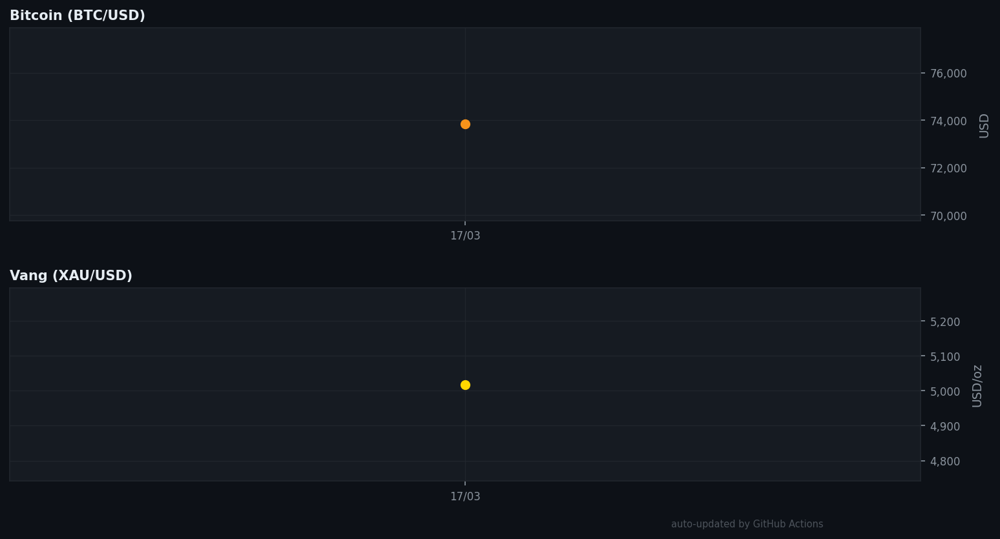

# 📊 Crypto & Gold Dashboard

**Dự án tự động cập nhật giá Bitcoin và Vàng mỗi ngày qua GitHub Actions.**
**Tự động gửi giá theo từng ngày qua bot t.me/@NeuroxChain_bot**
<!-- PRICE_START -->
## 📊 Giá hôm nay — 2026-03-20

> ⏱️ Tự động cập nhật lúc **2026-03-20 03:25 UTC** bởi [GitHub Actions](.github/workflows/update.yml)

### ₿ Bitcoin

| | Giá trị |
|---|---|
| 💰 Giá hiện tại | **$70,529.00** |
| 🔴 ▼ Thay đổi 24h | `-1.41%` |
| 📦 Market Cap | $1.41T |
| 🔄 Volume 24h | $44.80B |

### 🥇 Vàng (XAU)

| | Giá trị |
|---|---|
| 💰 Giá / troy oz | **$4,735.37** |
| ⚖️ Giá / gram | $152.25 |
| 🇻🇳 Giá / gram (VNĐ) | 3,988,541 ₫ |

### 📈 Thống kê 4 ngày qua

| | Bitcoin | Vàng |
|---|---|---|
| 🔺 Cao nhất | $74,538 | $5,018/oz |
| 🔻 Thấp nhất | $70,529 | $4,735/oz |
| 📉 Thay đổi | `-4.5%` | `-5.6%` |

### 📉 Biểu đồ 30 ngày

<!-- PRICE_END -->
